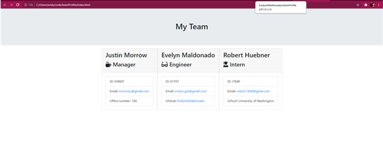

# Object-Oriented Programming: Team Profile Generator

 ## Table of Contents: 
  - [JS](#js)
  - [Requirements](#requirements)
  - [Installation](#installation)
  - [Contributing](#contributing)

## JS
        ${response.js}
        Created the prompts for the user to respond to and then create the HTML with, then created a function to initialize the app and grab the answers from the prompts to write the HTML. Another JS page created gets the licese information selected and also returns the Markdown with template literals.


## Requirements
        ${response.requirements}
        ```md
        GIVEN a command-line application that accepts user input
        WHEN I am prompted for my team members and their information
        THEN an HTML file is generated that displays a nicely formatted team roster based on user input
        WHEN I click on an email address in the HTML
        THEN my default email program opens and populates the TO field of the email with the address
        WHEN I click on the GitHub username
        THEN that GitHub profile opens in a new tab
        WHEN I start the application
        THEN I am prompted to enter the team manager’s name, employee ID, email address, and office number
        WHEN I enter the team manager’s name, employee ID, email address, and office number
        THEN I am presented with a menu with the option to add an engineer or an intern or to finish building my team
        WHEN I select the engineer option
        THEN I am prompted to enter the engineer’s name, ID, email, and GitHub username, and I am taken back to the menu
        WHEN I select the intern option
        THEN I am prompted to enter the intern’s name, ID, email, and school, and I am taken back to the menu
        WHEN I decide to finish building my team
        THEN I exit the application, and the HTML is generated
        ```


## Installation
        ${response.installation}
        Please follow the link below to see the team profile generator.

[Team Profile Generator Demo:](https://drive.google.com/file/d/1AVLQY-Uopmf-y-lghr5Cu-mamOwq507S/view?usp=sharing)
[Github Team Profile Generaator:](https://github.com/EvelynGMaldonado/teamProfile)



## Contributing
        ${response.contributing}
        If you have any suggestions, tips or ideas about how to improve this application, please reach out to:
        Email: evelyn.gmaldonado@gmail.com


